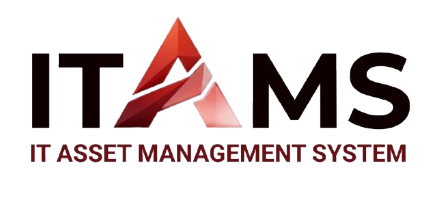

<div align="center">

  

  # ITAMS
  ### Enterprise IT Asset Management & Infrastructure Platform

  <p align="center">
    A robust, role-segregated custody tracking and lifecycle operations platform built with modern web technologies, PostgreSQL Row-Level Security, and dedicated role consoles.
  </p>

  <p align="center">
    
    
    
    
    
    
    
    
  </p>

</div>

---

## 📚 Documentation Suite

ITAMS maintains structured project and role documentation following a formal numbering convention:

| ID | Document | Summary |
| :---: | :--- | :--- |
| **`00`** | **[Project Overview](docs/00_PROJECT_OVERVIEW.md)** | Architectural pillars, technology stack, directory organization, and security handling. |
| **`001`** | **[Roles & Permissions Overview](docs/001_ROLES_AND_PERMISSIONS.md)** | Multi-tier RBAC matrix, credentials, dedicated role tables (`itsd_users`, `inventory_staff_users`, `end_users`), and RLS policies. |
| **`ARCH`** | **[Architecture & Conventions](docs/ARCHITECTURE_AND_CONVENTIONS.md)** | Coding standards, PascalCase vs camelCase conventions, React Context for Auth, Redux Toolkit, and hook-first principles. |
| **`SEED`** | **[Database & Seed Data Guide](docs/SEED_DATA.md)** | Instructions for executing `supabase/seed.sql` to initialize schema, RLS, and default role records. |
| **`zz`** | **[Archives & Legacy Resolutions](docs/zz_ARCHIVES.md)** | Technical history of decommissioned modules (public signup removal, sidebar cleanup) and critical bug fixes (GoTrue 500, RLS recursion, 406 queries, portal trapping, blank redirects). |

---

## 🗂️ Project Directory Structure

```
react-supabase-template/
├── docs/                                  # Project & Architecture Documentation
│   ├── 00_PROJECT_OVERVIEW.md             # Core system overview & pillars
│   ├── 001_ROLES_AND_PERMISSIONS.md       # Multi-tier RBAC & credentials
│   ├── ARCHITECTURE_AND_CONVENTIONS.md    # Frontend architectural standards
│   ├── README.md                          # Documentation index
│   ├── SEED_DATA.md                       # Supabase SQL setup guide
│   └── zz_ARCHIVES.md                     # Legacy archives & bug resolution log
├── public/                                # Static assets
│   ├── itams_logo.png                     # Official ITAMS brand logo
│   ├── favicon.svg                        # Browser tab icon
│   └── icons.svg                          # Vector sprite sheet
├── src/
│   ├── components/
│   │   ├── common/                        # Global shared application components
│   │   │   ├── AuthLoadingScreen.jsx      # Full-screen branded auth transition
│   │   │   ├── SignOutDialog.jsx          # Portal-based signout confirmation
│   │   │   └── UserMenuDropdown.jsx       # Header identity & credentials menu
│   │   ├── features/auth/                 # Authentication cards & showcase panels
│   │   │   ├── AuthCard.jsx
│   │   │   ├── AuthShowcase.jsx           # Animated brand welcome showcase
│   │   │   └── LoginForm.jsx              # Dual email/alias sign-in form
│   │   └── ui/                            # Reusable atomic UI primitives
│   │       ├── Button.jsx                 # Styled button with variants
│   │       ├── Card.jsx                   # Glassmorphic container card
│   │       ├── Input.jsx                  # Standardized form input field
│   │       └── Select.jsx                 # Dropdown selection primitive
│   ├── context/
│   │   └── AuthContext.jsx                # Session state, role resolving & transition bridge
│   ├── hooks/
│   │   ├── useAuth.js                     # Unified hook for auth state & methods
│   │   ├── useSidebar.js                  # Sidebar collapse & mobile drawer toggle
│   │   └── useUserRole.js                 # Role badge, label & permission checkers
│   ├── layouts/                           # Role-segregated layout consoles
│   │   ├── itsd/                          # ITSD Admin layout, header & sidebar
│   │   ├── inventory_staff/               # Inventory Staff layout, header & sidebar
│   │   └── end_users/                     # End User layout, header & sidebar
│   ├── pages/                             # Role consoles and global views
│   │   ├── itsd/                          # ITSD Administrator dashboard
│   │   ├── inventory_staff/               # Inventory & warehouse logistics dashboard
│   │   ├── end_users/                     # Employee personal custody dashboard
│   │   ├── DashboardPage.jsx              # Dynamic role-dispatching router page
│   │   ├── ForgotPasswordPage.jsx         # Credential recovery interface
│   │   ├── LoginPage.jsx                  # Primary authentication interface (/signin)
│   │   └── ProfileSettingsPage.jsx        # Identity, RBAC credentials & preferences (/profile)
│   ├── redux/                             # Global client state management (RTK)
│   ├── routes/                            # Navigation & route guards
│   │   ├── AppRoutes.jsx                  # Route registry & layout hierarchy
│   │   └── ProtectedRoute.jsx             # Session & role-matching guard
│   ├── services/
│   │   └── supabaseClient.js              # Initialized Supabase client instance
│   ├── App.jsx                            # Root component with AuthLoadingScreen
│   ├── index.css                          # Design tokens, theme variables & Tailwind
│   └── main.jsx                           # React DOM mount point
└── supabase/
    └── seed.sql                           # Idempotent DB schema, RLS policies & seed data
```

---

## 👥 Seed Credentials & Role Tiers

Institutional Master Password: **`Password123!`**

| Role Code | Role Name & Representative | Email / Login Alias | Accent Branding | Dedicated Table |
| :--- | :--- | :--- | :---: | :--- |
| **`itsd`** | **Alex Rivera**<br>Tier 3 Lead Admin | `itsd.admin@itams.edu`<br>`itsd.admin` | `Crimson Red` | `public.itsd_users` |
| **`inventory_staff`** | **Sarah Chen**<br>Lead Hardware Custodian | `inventory.staff@itams.edu`<br>`inventory.staff` | `Cobalt Blue` | `public.inventory_staff_users` |
| **`end_user`** | **Michael Torres**<br>Clinical Equipment Officer | `end.user@itams.edu`<br>`end.user` | `Emerald Green` | `public.end_users` |

---

## ⚡ Key Platform Highlights

1. **Strict Seeded Access**: Public self-registration is permanently decommissioned to safeguard organizational asset integrity. Only seeded/authorized accounts can authenticate.
2. **Dedicated Table Architecture**: Base user identity resides in `public.users`, while role-specific operational fields are segregated into dedicated tables (`public.itsd_users`, `public.inventory_staff_users`, `public.end_users`).
3. **Non-Recursive RLS**: Row-Level Security leverages `public.get_auth_user_role()`, a `SECURITY DEFINER` function with a fixed `search_path = public` that eliminates policy recursion.
4. **Adaptive Collapsible Sidebar**: Dynamic centered logo scaling (`h-14` open, `h-9` rail), official `LayoutDashboard` icon, and a floating hover/focus overlay in collapsed mode that avoids page reflows.
5. **Zero Blank Redirects**: Root-level [`AuthLoadingScreen.jsx`](src/components/common/AuthLoadingScreen.jsx) with a 700ms transition bridge ensures completely seamless authentication handshakes.
6. **Isolated Sign-Out Dialog**: Built with React Portals (`document.body`) to prevent stacking-context clipping or sidebar containment issues.

---

## 🚀 Getting Started

### 1. Prerequisites
- **Node.js**: v18+ or v20+
- **Package Manager**: [pnpm](https://pnpm.io/) (`npm install -g pnpm`)
- **Supabase Project**: Free or Pro Supabase cloud instance (or local Supabase CLI)

### 2. Environment Configuration
Create a `.env` file in the project root:
```env
VITE_SUPABASE_URL=https://your-project-id.supabase.co
VITE_SUPABASE_ANON_KEY=your-anon-key-here
```

### 3. Database Initialization
1. Open your **[Supabase Dashboard](https://app.supabase.com/)** -> **SQL Editor**.
2. Paste the contents of [`supabase/seed.sql`](supabase/seed.sql).
3. Execute the query. This configures the schema, RLS policies, GoTrue identities, and all seed accounts.

### 4. Install & Run with pnpm
```bash
# Install dependencies
pnpm install

# Start development server
pnpm dev

# Build for production
pnpm build

# Preview production build
pnpm preview
```

Visit `http://localhost:5173/signin` and log in with any of the seed accounts above.
"# Itams_Project" 
